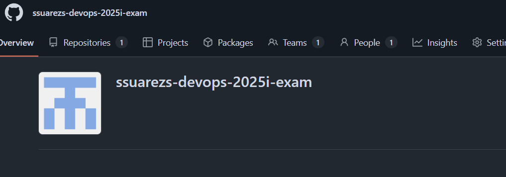
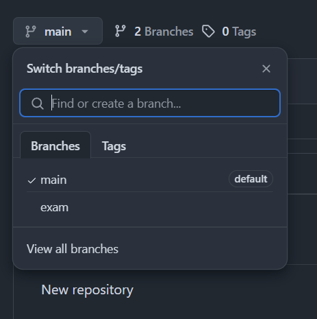
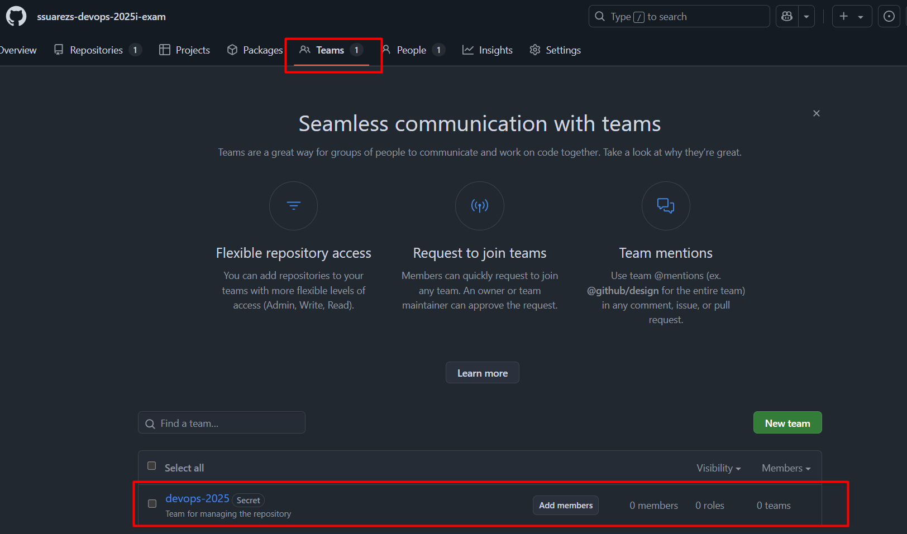
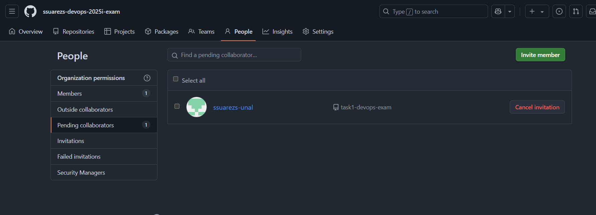

# Final Exam

**Universidad Nacional de Colombia**<br/>
DevOps & SRE Fundamentals, 2025i

**Student:** Santiago Suárez

[**Repository URL**](https://github.com/ssuarezs/dev-ops-2025i-exam)


---


## Task 1: Terraforrrm - GitHub Management

Manage GitHub resources with Terraform: create a repo, a branch, a team, and add a collaborator.


### Files

* `main.tf`: Terraform logic
* `variables.tf`: Input variables
* `outputs.tf`: Outputs

### Requirements

* Terraform installed
* GitHub Organization
* GitHub Personal Access Token with:

  * **repo** (admin, contents)
  * **organization** (members, admin)

### Quick Start

1. Clone this repo
2. Edit `terraform.tfvars`:

   ```hcl
   repository_name = "your-repo"
   team_name       = "your-team"
   collaborator    = "username"
   branch_name     = "new-branch"
   ```
3. Run:

   ```bash
   terraform init
   terraform plan
   terraform apply
   ```
   The command `terraform plan` will prompt you to enter the GitHub organization name and your personal access token if they are not provided in your `terraform.tfvars` file or as environment variables. Make sure to have this information ready.

4. Destroy (optional):

   ```bash
   terraform destroy
   ```

### Results & Evidence

* Organization: [View](https://github.com/ssuarezs-devops-2025i-exam)
* Repository: [View](https://github.com/ssuarezs-devops-2025i-exam/task1-devops-exam)
* Branch, team, collaborator: Created (see screenshots)

Generated token


Organization created



Repository created


Branch created



Team created



Collaborator added



---

## Task 2: Terraform - Banner

Creates a local ASCII art banner file using Terraform's `local_file` resource.

### Usage

1. `cd task2`
2. `terraform init`
3. `terraform apply`
4. See `banner.txt` for the result.

### Files

- `main.tf`: Terraform config
- `banner.txt`: Generated banner

---

## Task 3: DevOps & SRE Crossword

### Across

1. A specific type of Kubernetes API object used to extend its functionality, often associated with custom controllers. (3) — **CRD**
2. The practice of applying version control to all aspects of infrastructure, not just code. (3) — **IAC**
3. The concept of designing systems to absorb failure without significant service disruption, often achieved via redundancy. (9) — ****
4. A CNCF project that provides a declarative way to manage Kubernetes applications, often through helm charts. (4) — **ARGO**
5. A distributed tracing tool that originates from the OpenTracing and OpenCensus projects. (5) — ****
6. A specific type of container runtime, a low-level tool that implements the OCI specification. (4) — **RUNC**
7. A key metric in SRE that quantifies the difference between 100% uptime and the desired reliability. (5,6) — **ERROR BUDGET**
8. A FinOps practice that allocates cloud costs back to the business units or teams consuming resources. (9) — ****
9. The process of systematically investigating and resolving incidents to prevent recurrence. (11) — **POST-MORTEM**
10. A pattern for delivering applications to a set of users, initially hidden, for testing or performance evaluation. (4,6) — **DARK LAUNCH**
11. A security practice that involves intentionally introducing faults or attacks to test system resilience. (5,9) — **FAULT INJECTION**
12. A type of testing that ensures an application behaves correctly when encountering unusual or unexpected inputs. (7) — **FUZZING**
13. A component of the Linux kernel that isolates processes, foundational to containers. (8) — ****
14. A philosophy advocating continuous small, reversible changes, and valuing empirical evidence over plans. (4) — **LEAN**
15. A specialized type of database often used for metrics storage in monitoring systems like Prometheus. (7) — **INFLUXD**
16. A declarative API-driven tool for managing infrastructure state, often used with cloud resources. (9) — **TERRAFORM**
17. The 'E' in EKS or ECS, referring to managed container services. (8) — ****
18. A testing phase focused on the communication and interaction between integrated modules. (12) — ****
19. A specific type of automated deployment that routes a small percentage of users to a new version to validate. (6) — **CANARY**
20. A technique for securing applications by minimizing the attack surface and only allowing necessary functionality. (10) — **SANDBOXING**
21. The 'R' in ART, often a core responsibility in SRE. (10) — **RELIABILITY**

### Down

1. A design pattern where a system handles its own failures, rather than relying on external intervention. (10) — ****
2. A specific type of Kubernetes object that defines a set of pods and a replication controller to maintain their desired state. (9) — **DAEMONSET**
3. A tool used for generating and managing secrets, often integrated with CI/CD pipelines. (5) — **VAULT**
4. A critical metric in incident management measuring the mean time to detect an issue. (4) — **MTTD**
5. A concept where applications are self-contained and don't rely on external services for configuration or state. (12) — **TWELVEFACTOR**
6. A specific type of Git operation that rewrites commit history, often for cleaner branches. (6) — **REBASE**
7. A lightweight, portable proxy often used as the data plane in a service mesh. (5) — **ENVOY**
8. A testing methodology focused on breaking down the system into individual units and testing them in isolation. (4) — **UNIT**
9. A property of operations that produce the same result regardless of how many times they are executed. (10) — **IDEMPOTENT**
10. The discipline of managing and optimizing cloud spending. (6) — **FINOPS**
11. A governance policy that ensures resources are provisioned and operated according to predefined rules. (5,4) — **GUARD RAILS**
12. The underlying framework or standard that defines how container images are built and run. (3) — **OCI**
13. A testing technique that involves randomly feeding invalid inputs to a program to find crashes or bugs. (7) — **FUZZING**
14. A specific type of load balancer often used in service meshes to handle inter-service communication. (5) — **ENVOY**
15. A principle of building resilient systems by minimizing dependencies and ensuring services can degrade gracefully. (8) — ****
16. A pattern where a service consumes events from a message queue to trigger actions. (5,5) — **EVENT QUEUE**
17. A type of automated security testing focused on finding vulnerabilities in running applications by observing inputs/outputs. (4) — **DAST**
18. A formal review of an incident to identify contributing factors and prevent recurrence, often blameless. (11) — **POST-MORTEM**
19. A specific type of code analysis that examines source code without executing it, for security or quality. (6) — **STATIC**
20. A version control system known for its distributed nature and branching capabilities. (3) — **GIT**
21. A common tool for orchestrating multi-container Docker applications. (6) — **COMPOSE**

---

## Task 4
