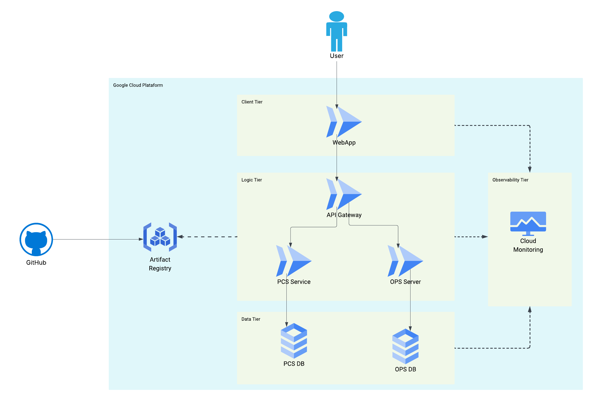

# Final Exam

**Universidad Nacional de Colombia**<br/>
DevOps & SRE Fundamentals, 2025i

**Student:** Santiago Suárez

[**Repository URL**](https://github.com/ssuarezs/dev-ops-2025i-exam)


---


## Task 1: Terraforrrm - GitHub Management

Manage GitHub resources with Terraform: create a repo, a branch, a team, and add a collaborator.


### Files

* `main.tf`: Terraform logic
* `variables.tf`: Input variables
* `outputs.tf`: Outputs

### Requirements

* Terraform installed
* GitHub Organization
* GitHub Personal Access Token with:

  * **repo** (admin, contents)
  * **organization** (members, admin)

### Quick Start

1. Clone this repo
2. Edit `terraform.tfvars`:

   ```hcl
   repository_name = "your-repo"
   team_name       = "your-team"
   collaborator    = "username"
   branch_name     = "new-branch"
   ```
3. Run:

   ```bash
   terraform init
   terraform plan
   terraform apply
   ```
   The command `terraform plan` will prompt you to enter the GitHub organization name and your personal access token if they are not provided in your `terraform.tfvars` file or as environment variables. Make sure to have this information ready.

4. Destroy (optional):

   ```bash
   terraform destroy
   ```

### Results & Evidence

* Organization: [View](https://github.com/ssuarezs-devops-2025i-exam)
* Repository: [View](https://github.com/ssuarezs-devops-2025i-exam/task1-devops-exam)
* Branch, team, collaborator: Created (see screenshots)

Generated token


Organization created


Repository created


Branch created


Team created


Collaborator added


---

## Task 2: Terraform - Banner

Creates a local ASCII art banner file using Terraform's `local_file` resource.

### Usage

1. `cd task2`
2. `terraform init`
3. `terraform apply`
4. See `banner.txt` for the result.

### Files

- `main.tf`: Terraform config
- `banner.txt`: Generated banner

---

## Task 3: DevOps & SRE Crossword

### Across

1. A specific type of Kubernetes API object used to extend its functionality, often associated with custom controllers. (3) — **CRD**
2. The practice of applying version control to all aspects of infrastructure, not just code. (3) — **IAC**
3. The concept of designing systems to absorb failure without significant service disruption, often achieved via redundancy. (9) — **RESILIENT**
4. A CNCF project that provides a declarative way to manage Kubernetes applications, often through helm charts. (4) — **ARGO**
5. A distributed tracing tool that originates from the OpenTracing and OpenCensus projects. (5) — **TEMPO**
6. A specific type of container runtime, a low-level tool that implements the OCI specification. (4) — **RUNC**
7. A key metric in SRE that quantifies the difference between 100% uptime and the desired reliability. (5,6) — **ERROR BUDGET**
8. A FinOps practice that allocates cloud costs back to the business units or teams consuming resources. (9) — ****
9. The process of systematically investigating and resolving incidents to prevent recurrence. (11) — **POST-MORTEM**
10. A pattern for delivering applications to a set of users, initially hidden, for testing or performance evaluation. (4,6) — **DARK LAUNCH**
11. A security practice that involves intentionally introducing faults or attacks to test system resilience. (5,9) — **FAULT INJECTION**
12. A type of testing that ensures an application behaves correctly when encountering unusual or unexpected inputs. (7) — **FUZZING**
13. A component of the Linux kernel that isolates processes, foundational to containers. (8) — **CGROUPFS**
14. A philosophy advocating continuous small, reversible changes, and valuing empirical evidence over plans. (4) — **LEAN**
15. A specialized type of database often used for metrics storage in monitoring systems like Prometheus. (7) — **INFLUXD**
16. A declarative API-driven tool for managing infrastructure state, often used with cloud resources. (9) — **TERRAFORM**
17. The 'E' in EKS or ECS, referring to managed container services. (8) — ****
18. A testing phase focused on the communication and interaction between integrated modules. (12) — **INTEGRATIONS**
19. A specific type of automated deployment that routes a small percentage of users to a new version to validate. (6) — **CANARY**
20. A technique for securing applications by minimizing the attack surface and only allowing necessary functionality. (10) — **SANDBOXING**
21. The 'R' in ART, often a core responsibility in SRE. (10) — **RELIABILITY**

### Down

1. A design pattern where a system handles its own failures, rather than relying on external intervention. (10) — ****
2. A specific type of Kubernetes object that defines a set of pods and a replication controller to maintain their desired state. (9) — **DAEMONSET**
3. A tool used for generating and managing secrets, often integrated with CI/CD pipelines. (5) — **VAULT**
4. A critical metric in incident management measuring the mean time to detect an issue. (4) — **MTTD**
5. A concept where applications are self-contained and don't rely on external services for configuration or state. (12) — **TWELVEFACTOR**
6. A specific type of Git operation that rewrites commit history, often for cleaner branches. (6) — **REBASE**
7. A lightweight, portable proxy often used as the data plane in a service mesh. (5) — **ENVOY**
8. A testing methodology focused on breaking down the system into individual units and testing them in isolation. (4) — **UNIT**
9. A property of operations that produce the same result regardless of how many times they are executed. (10) — **IDEMPOTENT**
10. The discipline of managing and optimizing cloud spending. (6) — **FINOPS**
11. A governance policy that ensures resources are provisioned and operated according to predefined rules. (5,4) — **GUARD RAILS**
12. The underlying framework or standard that defines how container images are built and run. (3) — **OCI**
13. A testing technique that involves randomly feeding invalid inputs to a program to find crashes or bugs. (7) — **FUZZING**
14. A specific type of load balancer often used in service meshes to handle inter-service communication. (5) — **ENVOY**
15. A principle of building resilient systems by minimizing dependencies and ensuring services can degrade gracefully. (8) — ****
16. A pattern where a service consumes events from a message queue to trigger actions. (5,5) — **EVENT QUEUE**
17. A type of automated security testing focused on finding vulnerabilities in running applications by observing inputs/outputs. (4) — **DAST**
18. A formal review of an incident to identify contributing factors and prevent recurrence, often blameless. (11) — **POST-MORTEM**
19. A specific type of code analysis that examines source code without executing it, for security or quality. (6) — **STATIC**
20. A version control system known for its distributed nature and branching capabilities. (3) — **GIT**
21. A common tool for orchestrating multi-container Docker applications. (6) — **COMPOSE**

---

## Task 4

### Scenario

Your company, **QuantumLeap Innovations**, is launching a new, highly anticipated e-commerce platform. You are tasked with designing, implementing, and defining the operational strategy for its critical backend services on **Google Cloud Platform**. The initial launch will target a single region, but future expansion to multiple regions is anticipated.

The core backend consists of two primary microservices:

1. **Product Catalog Service (PCS)**: A read-heavy service providing product information. It queries a PostgreSQL database and utilizes a caching layer.
2. **Order Processing Service (OPS)**: A write-heavy service responsible for handling new orders. It writes to a transactional PostgreSQL database and publishes order events to a message queue for downstream processing (e.g., fulfillment, notifications).

---

### Non-Functional Requirements (NFRs)

- **High Availability**:
  The system must tolerate zonal outages within the chosen Google Cloud region with minimal impact on user experience. Target 99.95% availability for critical services.

- **Scalability**:
  The system must automatically scale to handle variable load, from a few thousand concurrent users to peak traffic of 100,000 requests per minute.

- **Reliability**:
  Order processing must be robust, ensuring no data loss and successful delivery of order events. The system should self-heal where possible.

- **Security**:
  All components must adhere to the principle of least privilege. Data in transit and at rest must be encrypted. Secrets must be managed securely.

- **Observability**:
  Comprehensive monitoring, logging, and tracing must be in place to quickly identify and diagnose issues.

- **Cost-Effectiveness**:
  Design choices should balance performance and reliability with cost optimization.

- **Deployment Velocity**:
  The team requires a robust CI/CD pipeline for frequent, automated deployments with minimal downtime.

---

### Constraints & Preferences

- **Google Cloud Platform (GCP)**: All infrastructure and services must be deployed on GCP.
- **Infrastructure as Code (IaC)**: All GCP infrastructure must be defined and managed using Terraform.
- **Containerization**: Both microservices must be containerized.
- **Orchestration**: Google Kubernetes Engine (GKE) is the preferred container orchestration platform.
- **CI/CD**: Use Cloud Build for CI/CD pipelines. Integration with GitHub (or Cloud Source Repositories) for source control is assumed.
- **GenAI Tool**: You are required to demonstrate the use of a GenAI tool (e.g., GitHub Copilot) during your development process. Document specific instances where it assisted you.
- **Database**: Cloud SQL for PostgreSQL for both services' databases.
- **Caching**: Memorystore for Redis for the PCS caching layer.
- **Messaging**: Cloud Pub/Sub for asynchronous order events.
- **Load Balancing**: Global External HTTP(S) Load Balancer for external access.
- **Networking**: Private networking between components as much as possible.

---

### The Challenge Tasks

#### Architectural Design & Justification

- **High-Level Architecture Diagram**:
  Create a detailed architecture diagram (e.g., using Google Cloud's official iconography) showcasing all major GCP components, network flows, and interactions between services.

- **Service Selection Justification**:
  For each major GCP service chosen (GKE, Cloud SQL, Memorystore, Pub/Sub, Load Balancer, etc.), provide a concise justification for its selection based on the NFRs and constraints. Explain why it's a suitable choice over potential alternatives (e.g., why Cloud SQL over self-managed PostgreSQL on GCE).

- **Reliability & HA Strategy**:
  Detail your strategy for achieving 99.95% availability, specifically addressing:
  - Zonal redundancy for GKE workloads and stateful services.
  - Database failover and backup strategy.
  - Caching layer resilience.
  - Messaging system guarantees.
  - Deployment strategies (e.g., Blue/Green, Canary) to minimize downtime during updates.

- **Security Posture**:
  Outline key security considerations for the entire infrastructure, including:
  - VPC Network design (subnets, firewall rules).
  - Service Account permissions and least privilege.
  - Secret management strategy (e.g., Secret Manager).
  - Container image security (e.g., Artifact Registry scanning).

- **Cost Optimization Strategy**:
  Briefly describe how your design choices contribute to cost-effectiveness while meeting NFRs (e.g., auto-scaling, right-sizing).

### Solution Task 4

#### High-Level Architecture Diagram Description

The architecture includes a frontend Web App that communicates through an API Gateway to two backend services:
- **Product Catalog Service (PCS)**
- **Order Processing Service (OPS)**

All components are deployed on **Google Cloud Run** for simplicity and scalability. Services connect to their respective **Cloud SQL (PostgreSQL)** instances.
A centralized **Monitoring and Logging** solution is set up using **Cloud Operations Suite** (formerly Stackdriver).
All traffic is routed via Cloud Run’s integrated **Load Balancer**.



#### Service Selection Justification

- **Cloud Run**: Chosen for its simplicity, automatic scaling, and managed environment which reduces operational overhead.
- **Cloud SQL (PostgreSQL)**: Managed database service with high availability and integrated backups.
- **Artifact Registry**: Used to store and deploy container images.
- **Cloud Operations Suite**: Used for built-in monitoring, logging, and tracing without additional setup.
- **Cloud Load Balancing**: Already integrated with Cloud Run for managed traffic distribution.
- **GitHub + GitHub Actions**: Used for source control and CI/CD automation, allowing simple integration and fast deployment pipelines.


#### Reliability & HA Strategy

- **Database Backups and Redundancy**: Cloud SQL is configured with automated backups and multi-zone redundancy.
- **Deployment Strategy**: Blue-Green deployments are used to ensure seamless updates and reduce downtime.

#### Security Posture

- **IAM Roles**: Principle of least privilege applied using dedicated service accounts.
- **Secret Manager**: Used for secure management of credentials and configuration.
- **HTTPS Traffic Only**: Enforced through the managed load balancer.
- **Artifact Scanning**: Enabled for container images via Artifact Registry.

#### Cost Optimization Strategy

- **Pay-per-use model** of Cloud Run helps minimize cost at low traffic.
- **Auto-scaling** reduces waste in idle times.
- **Managed services** reduce operational overhead and team load.
