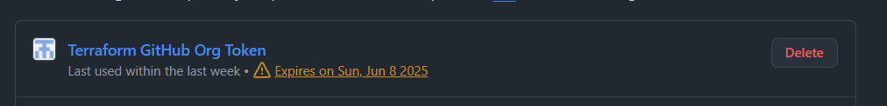
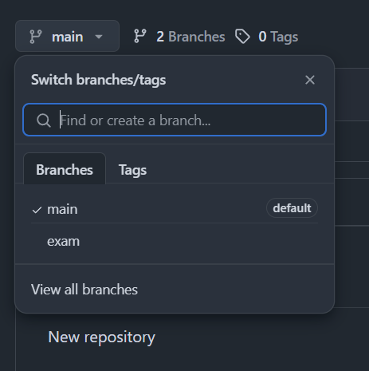

## Task 1: Terraforrrm - GitHub Management

Manage GitHub resources with Terraform: create a repo, a branch, a team, and add a collaborator.


### Files

* `main.tf`: Terraform logic
* `variables.tf`: Input variables
* `outputs.tf`: Outputs

### Requirements

* Terraform installed
* GitHub Organization
* GitHub Personal Access Token with:

  * **repo** (admin, contents)
  * **organization** (members, admin)

### Quick Start

1. Clone this repo
2. Edit `terraform.tfvars`:

   ```hcl
   repository_name = "your-repo"
   team_name       = "your-team"
   collaborator    = "username"
   branch_name     = "new-branch"
   ```
3. Run:

   ```bash
   terraform init
   terraform plan
   terraform apply
   ```
   The command `terraform plan` will prompt you to enter the GitHub organization name and your personal access token if they are not provided in your `terraform.tfvars` file or as environment variables. Make sure to have this information ready.

4. Destroy (optional):

   ```bash
   terraform destroy
   ```

### Results & Evidence

* Organization: [View](https://github.com/ssuarezs-devops-2025i-exam)
* Repository: [View](https://github.com/ssuarezs-devops-2025i-exam/task1-devops-exam)
* Branch, team, collaborator: Created (see screenshots)

Generated token



Organization created


Repository created


Branch created



Team created


Collaborator added


