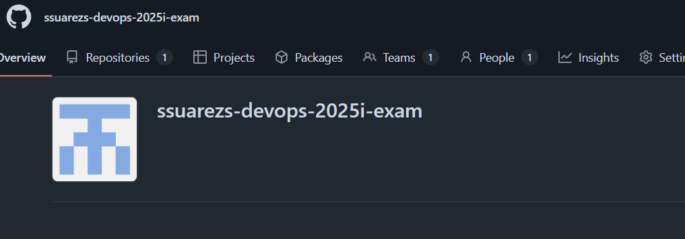
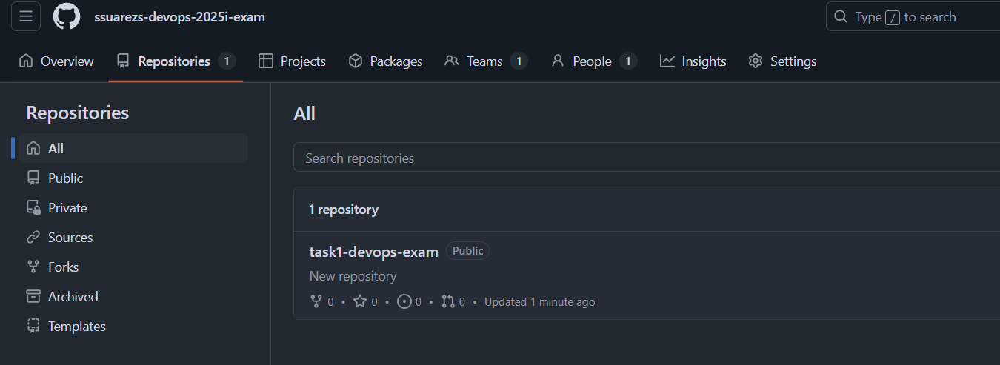
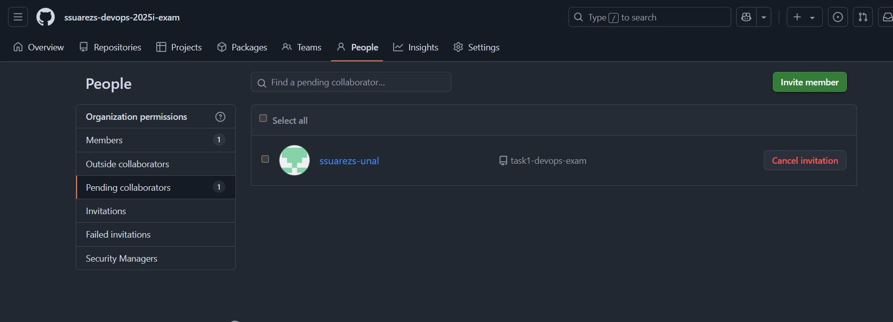

# Terraform GitHub Project

This project uses Terraform to manage GitHub resources. It creates a GitHub repository, a new branch, a team, and adds a collaborator to the repository.


## Project Structure

- `main.tf`: Contains the main Terraform configuration.
- `variables.tf`: Defines the input variables for the Terraform configuration.
- `outputs.tf`: Specifies the output values for the Terraform configuration.

## Prerequisites

- Terraform installed on your machine.
- A GitHub personal access token with the necessary permissions.

## Setup Instructions

1. Clone this repository.
2. Navigate to the project directory
3. Modify the `terraform.tfvars` file to define your variables:
   ```hcl
   repository_name = "your-repo-name"
   team_name       = "your-team-name"
   collaborator    = "collaborator-username"
   branch_name     = "your-branch-name"
   ```

4. Initialize Terraform:
   ```
   terraform init
   ```

5. Plan the deployment:
   ```
   terraform plan
   ```
   This command will prompt you to enter the GitHub organization name and your personal access token if they are not provided in your `terraform.tfvars` file or as environment variables. Make sure to have this information ready.

6. Apply the configuration:
   ```
   terraform apply
   ```

## Cleanup

To remove the resources created by this project, run:
```
terraform destroy
```

# Results

## Token permissions

The GitHub personal access token used for this project must include the following permissions:

- **repo**: Full control of private repositories. Required to create repositories, branches, and manage collaborators.
    - admin
    - contents
- **organization**: (Only if you are working within a GitHub organization) Allows management of teams and members.
    - members
    - admin

### Generated token


## Evidence

### Organization created

[View organization on GitHub](https://github.com/ssuarezs-devops-2025i-exam)



### Repository created

[View repository on GitHub](https://github.com/ssuarezs-devops-2025i-exam/task1-devops-exam)



### Branch created


### Team created


### Collaborator added


